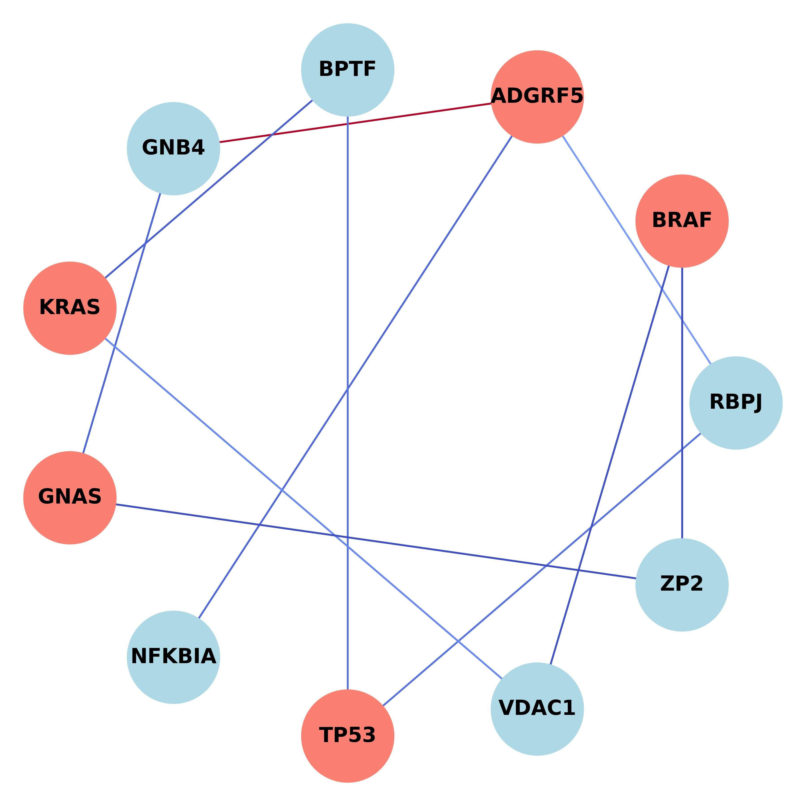
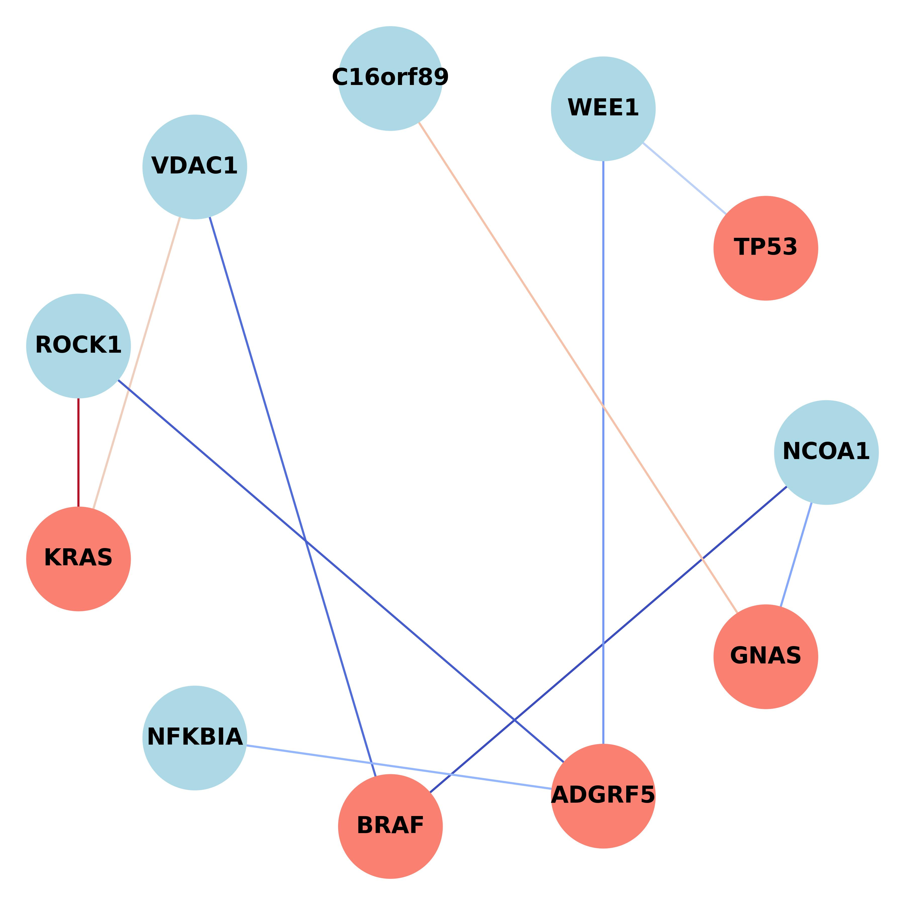

# Contrastive-Learning-for-Graph-Based-Biological-Interaction-Discovery

## Overview
This is the code repository for the article entitled: "Contrastive Learning for Graph-Based Biological Interaction Discovery: Insights from Oncologic Pathways"

## Discovered Pathways
 


## Trends in Clinical Interests of Discovered Biomarkers


## Code Usage
### Extract targeting interaction networks and its adjacency matrix
```python
python 0_data_preprocessing.py
```
### Contrastive learning on Isomorphic Graphs
```python
python 1_cl_graph.py
```
### Assembling synthesized networks
```python
python 2_ensemble_result.py
```
### Model Architecture
```python
model.py
```

